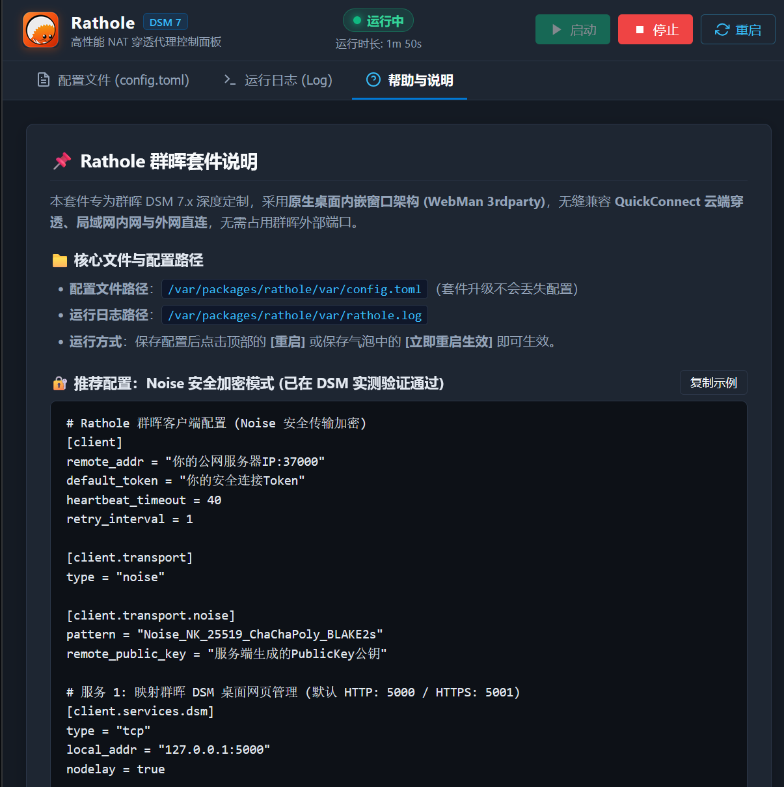

# Rathole for Synology DSM 7 (dsm-app-rathole)

<p align="center">
  
</p>

<p align="center">
  <a href="#english">English</a> | <a href="#中文说明">中文说明</a>
</p>

---

<a name="english"></a>
## English

### Introduction

[Rathole](https://github.com/rathole-org/rathole) is a lightweight, high-performance reverse proxy for NAT traversal written in Rust.

**dsm-app-rathole** provides an easy-to-use WebUI package (SPK) for Synology DSM 7.x, allowing you to configure and manage the Rathole client directly from your Synology DSM desktop.

### Features

- **GUI Management**: Start, stop, and restart Rathole directly from your DSM desktop with real-time status and uptime.
- **Online Config Editor**: Edit TOML configuration files directly in your browser with template insertion and unsaved change protection.
- **Instant Restart**: Easily restart the service directly from the save confirmation prompt.
- **Log Viewer & Filter**: View runtime logs with color-coded errors and keyword filtering.
- **Low Resource Usage**: Runs as a lightweight background service without requiring Python or Web Station.

### Installation

1. Download the `.spk` package for your NAS architecture from the [Releases](https://github.com/openif/dsm-app-rathole/releases) page:
   - **Realtek RTD1296 (ARM64)**: For DS220j, DS120j, DS218, etc. -> `rathole_rtd1296_*.spk`
   - **ARM64 (aarch64)**: For general 64-bit ARM models -> `rathole_aarch64_*.spk`
   - **x86_64**: For Intel / AMD models (DS920+, DS220+, DS918+, etc.) -> `rathole_x86_64_*.spk`
2. In Synology DSM, open **Package Center** -> click **Manual Install**.
3. Choose the downloaded `.spk` file and follow the wizard to install.
4. Launch **Rathole** from the DSM main menu.

### Configuration Examples

#### 1. Noise Encryption Mode (Recommended)

```toml
# Client configuration with Noise encryption
[client]
remote_addr = "YOUR_SERVER_IP:37000"
default_token = "YOUR_SECRET_TOKEN"
heartbeat_timeout = 40
retry_interval = 1

[client.transport]
type = "noise"

[client.transport.noise]
pattern = "Noise_NK_25519_ChaChaPoly_BLAKE2s"
remote_public_key = "SERVER_PUBLIC_KEY"

# Service 1: Map DSM Web UI (HTTP 5000 / HTTPS 5001)
[client.services.dsm]
type = "tcp"
local_addr = "127.0.0.1:5000"
nodelay = true

# Service 2: Map SSH (Port 22)
[client.services.ssh]
type = "tcp"
local_addr = "127.0.0.1:22"
nodelay = true
```

#### 2. Standard TCP Mode

```toml
# Client configuration (Plain TCP)
[client]
remote_addr = "YOUR_SERVER_IP:2333"
default_token = "YOUR_SECRET_TOKEN"
heartbeat_timeout = 40
retry_interval = 1

[client.transport]
type = "tcp"

# Service 1: Map DSM Web UI
[client.services.dsm]
type = "tcp"
local_addr = "127.0.0.1:5000"
nodelay = true

# Service 2: Map SSH
[client.services.ssh]
type = "tcp"
local_addr = "127.0.0.1:22"
nodelay = true
```

### Important Paths

- **Config file**: `/var/packages/rathole/var/config.toml` (preserved across package upgrades)
- **Log file**: `/var/packages/rathole/var/rathole.log`

---

<a name="中文说明"></a>
## 中文说明

### 简介

[Rathole](https://github.com/rathole-org/rathole) 是一款基于 Rust 开发的高性能、轻量级反向代理与 NAT 穿透工具。

**dsm-app-rathole** 是为群晖 DSM 7.x 系统制作的原生 SPK 安装套件，提供可视化的网页控制面板，方便在群晖桌面直接配置和管理 Rathole 客户端。

### 主要功能

- **图形化控制**：在群晖桌面一键启动、停止、重启 Rathole 服务，直观显示运行状态与运行时长。
- **在线编辑配置**：提供在线 TOML 文本编辑器与常用模板，支持快捷键保存（`Ctrl + S`），修改未保存时会自动提示防丢失。
- **保存后一键重启**：保存配置文件后，可在提示气泡中直接点击“立即重启生效”，简化操作步骤。
- **日志查看与过滤**：实时查看运行日志，自动标红错误信息，并支持输入关键字快速过滤筛选。
- **低资源占用**：后台轻量运行，不需要安装 Python 或 Web Station 等额外套件。

### 安装方法

1. 前往项目的 [Releases 发布页面](https://github.com/openif/dsm-app-rathole/releases) 下载对应 NAS 架构的 `.spk` 安装包：
   - **Realtek RTD1296 (ARM64)**：适用于 DS220j, DS120j, DS218 等，下载 `rathole_rtd1296_*.spk`
   - **通用 ARM64 (aarch64)**：下载 `rathole_aarch64_*.spk`
   - **Intel / AMD (x86_64)**：适用于 DS920+, DS220+, DS918+ 等，下载 `rathole_x86_64_*.spk`
2. 打开群晖 DSM **套件中心**，点击右上角 **“手动安装”**；
3. 选择下载好的 `.spk` 文件上传，按向导完成安装；
4. 安装完成后，在群晖主菜单或桌面打开 **“Rathole”** 即可进入控制面板。

### 常用客户端配置示例

#### 1. Noise 安全传输模式（推荐）

```toml
# Rathole 群晖客户端配置 (Noise 安全传输加密)
[client]
remote_addr = "你的公网服务器IP:37000"
default_token = "你的安全连接Token"
heartbeat_timeout = 40
retry_interval = 1

[client.transport]
type = "noise"

[client.transport.noise]
pattern = "Noise_NK_25519_ChaChaPoly_BLAKE2s"
remote_public_key = "服务端生成的PublicKey公钥"

# 服务 1: 映射群晖 DSM 桌面网页管理 (默认 HTTP 5000 / HTTPS 5001)
[client.services.dsm]
type = "tcp"
local_addr = "127.0.0.1:5000"
nodelay = true

# 服务 2: 映射群晖 SSH 终端端口 (默认 22)
[client.services.ssh]
type = "tcp"
local_addr = "127.0.0.1:22"
nodelay = true
```

#### 2. 普通 TCP 模式

```toml
# Rathole 群晖客户端配置 (普通 TCP 模式)
[client]
remote_addr = "你的公网服务器IP:2333"
default_token = "你的安全连接Token"
heartbeat_timeout = 40
retry_interval = 1

[client.transport]
type = "tcp"

# 服务 1: 映射群晖 DSM 控制面板
[client.services.dsm]
type = "tcp"
local_addr = "127.0.0.1:5000"
nodelay = true

# 服务 2: 映射群晖 SSH
[client.services.ssh]
type = "tcp"
local_addr = "127.0.0.1:22"
nodelay = true
```

### 关键路径

- **配置文件**：`/var/packages/rathole/var/config.toml`（套件升级或覆盖安装不会丢失）
- **运行日志**：`/var/packages/rathole/var/rathole.log`

---

## 📄 License

- Licensed under [Apache-2.0](LICENSE).
- Core proxy engine: [rathole-org/rathole](https://github.com/rathole-org/rathole)
